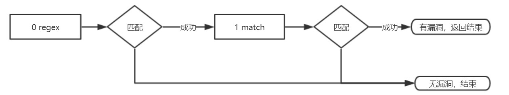

# Shock Wave

<p>
  
  
  
  
</p>

```txt
         __               __                           
   _____/ /_  ____  _____/ /___      ______ __   _____ 
  / ___/ __ \/ __ \/ ___/ //_/ | /| / / __ `/ | / / _ \
 (__  ) / / / /_/ / /__/ ,<  | |/ |/ / /_/ /| |/ /  __/
/____/_/ /_/\____/\___/_/|_| |__/|__/\__,_/ |___/\___/ 
                                                       
```

 Shock Wave is a static analysis tool of smart contracts.

Current version: 2.0

Author : Tri0nes

[中文版本(Chinese version)](./README_cn.md)


This tool was written when I first known smart contract. At the time, there was no static auditing tool. Therefore, based on past auditing experience, I wrote a static analysis tool based on RegEx. Although there is a certain false positive rate, it is fast, which is convenient for us to quickly analyze. And false positive rates can be improved by improving RegEx.

> Why choose regular?

Because it is fast to write, easy to use, and fast to analyze. It is good for fast full code detection after the vulnerability is discovered.

> What are the characteristics?

1. Using a rule script, the same vulnerability is detected in multiple situations.
2. There are a lot of detection items, and 50+ rules have been accumulated.

## Install

```bash
git clone https://github.com/XuanMaoSecLab/shockwave.git
cd ShockWave
pip3 install -r requirements.txt
```

Config is in [setting.py](./setting.py).

## How to use

>Usage: `python3 shockwave.py [options]`

```txt
optional arguments:
  -h, --help       show this help message and exit
  -d               default : analyse local files
  
  -t               target address
  --target-file    target address list file

  -l               analyse local code files
  --local-dir      analyse local code directory

  -r RULE          designate vulnerability rules ID likes A.1,A.2,C.1,D.1
```

Example：

`py -3 shockwave.py -t 0x000000002bb43c83eCe652d161ad0fa862129A2C -r A`

`python3 shockwave.py -d`

`py -3 shockwave.py --target-file addrs.txt -r A`

`python3 shockwave.py -l ./codes/DAO_0xBB9bc244D798123fDe783fCc1C72d3Bb8C189413.sol -r A.11,E.8`

`python3 shockwave.py --local-dir /tmp/codes/ -v A.17`

## Rule Guide

Rule file example as shown below. Shown here as two matching combinations, the matching method can be increased indefinitely.

```yaml
description:
 name: A.1 rulename
 ver: 1
 done: what had done
 todo: what to do
0:
  method: regex
  usage: rule usage
  factor:
   - M
   - I
   - S
  fetch: True
  match:
    True: next
    False: fail
  rule: regex.*example
1:
  method: match
  usage: rule usage
  fetch: False
  match:
    True: fail
    False: success
  rule:
   - match example1
   - match example2
```

## Core Flow



## Rule Example

As explained below, the `LackChecking.yaml` is used to check if there is no conditional check on the `allowed` in the `transferFrom` function.

```yaml
description:
 name: E.3 allowAnyone
 ver: 1
 done: most
 todo: none
0:
  method: regex
  usage: first, fetch the key code
  factor:
   - 0
   - I
   - 0
  fetch: True
  match:
    True: next
    False: fail
  rule: transferFrom[^}]*\n[\s\S]*?allowed\[_from]\[msg\.sender] -= _value
1:
  method: regex
  usage: find require check
  factor:
   - 0
   - I
   - 0
  fetch: False
  match:
    True: fail
    False: next
  rule: require.*allowed\[_from]\[msg\.sender][ ]*>[ =]*_value
2:
  method: regex
  usage: find if check
  factor:
   - 0
   - I
   - 0
  fetch: False
  match:
    True: fail
    False: next
  rule: ^.*[^\/]if.*allowed\[_from]\[msg\.sender][ ]>[ =]+_value.*\{\n
3:
  method: match
  usage: exclude dissatisfaction
  fetch: False
  match:
    True: fail
    False: success
  rule:
    - previousBalances
    - allowance >= _value
```

## More rules

Send the key word *`shockwave`* to the WeChat Official Account `区块安全` get the latest detection rule script。

 

## Contribution

Any contribution is welcome.

## Backer and Sponsor

<p>
  <a href="https://www.bugx.io" target="_blank"></a>
  <a href="https://github.com/XuanMaoSecLab" target="_blank"></a>
</p>

## License

ShockWave is licensed under the Apache License 2.0 License. See [LICENSE](LICENSE) for the full license text.
