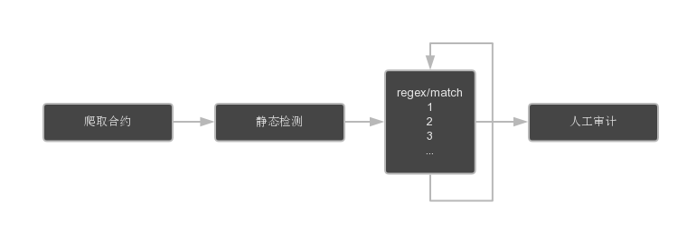

# ShockWave

```txt
         __               __                           
   _____/ /_  ____  _____/ /___      ______ __   _____ 
  / ___/ __ \/ __ \/ ___/ //_/ | /| / / __ `/ | / / _ \
 (__  ) / / / /_/ / /__/ ,<  | |/ |/ / /_/ /| |/ /  __/
/____/_/ /_/\____/\___/_/|_| |__/|__/\__,_/ |___/\___/ 
                                                       
```

 ShockWave 是一个智能合约的静态分析工具。

当前版本 : 2.0

[英文版本(English version)](./README.md)



此工具为一开始接触合约时所写，当时没有静态审计工具，于是基于以往审计经验写了一个基于正则的静态分析工具，虽然存在一定的误报率，但是速度快，有利我们快速分析获取所有可能存在问题的合约，而误报率可以通过改进正则改善。

> 为什么选择正则？

因为写起来快，上手简单，检测速度快。有利于在发现漏洞后，快速全量代码检测。

> 有什么特点？

1. 使用规则脚本，同一漏洞对应多种情况进行检测。
2. 检测项丰富，目前已经累积 50+ 规则。

## 安装

```bash
git clone https://github.com/XuanMaoSecLab/shockwave.git
cd ShockWave
pip3 install -r requirements.txt
```

配置文件位于 [setting.py](./setting.py).

## 如何使用

>Usage: `python3 shockwave.py [options]`

```txt
optional arguments:
  -h, --help       show this help message and exit
  -d               default : analyse local files
  -t               target address
  --target-file    target address list file
  -l               analyse local code files
  --local-dir      analyse local code directory
  -r RULE          designate vulnerability rules ID likes A.1,A.2,C.1,D.1
```

-d

默认模式，使用 `rules` 下全部规则，扫描 `codes` 下代码

-t

指定扫描的合约地址,先检测本地有没有，没有的话就下载一个，并记录到 `info.csv` 文件

--target-file

指定扫描的合约地址列表文件

-l

指定扫描本地代码文件

--local-dir

指定扫描本地代码目录

-r

指定静态扫描脚本名编号，默认为加载全部

Example：

`python3 shockwave.py -d`

使用 rules 下全部规则扫描 codes 目录下所有文件，输出为到 `output/output.csv` 中

`py -3 shockwave.py -t 0x000000002bb43c83eCe652d161ad0fa862129A2C -r A`

下载并扫描合约

`py -3 shockwave.py --target-file addrs.txt -r A`

下载并分析 `addrs.txt` 中所有地址的合约，使用的规则是 `A`

`python3 shockwave.py -l ./codes/DAO_0xBB9bc244D798123fDe783fCc1C72d3Bb8C189413.sol -r A.11,E.8`

扫描 `./codes/DAO_0xBB9bc244D798123fDe783fCc1C72d3Bb8C189413.sol` 文件,扫描使用的规则为`A.11` 和 `E.8`

`python3 shockwave.py --local-dir /tmp/codes/ -v A.17`

扫描指定文件夹

## 规则指引

规则脚本说明如下，这里展示为两条匹配组合，匹配方式可以无限量增加，如下面的 Rule Example 中所示。

```yaml
description:
 name: A.1 rulename # 规则名称
 ver: 1 # 规则版本
 done: what had done # 规则目前已经完成的功能
 todo: what to do # 规则待完成功能
0:
  method: regex # 正则匹配模式  (有 regex 正则模式 和 match 纯文本模式)
  usage: rule usage # 说明文字，用于说明本条匹配的功能作用
  factor: # 匹配元素，用于 python 匹配方式中的 re.M 、re.I、re.S 的设置
   - M # 是否多行匹配
   - I # 是否忽略大小写
   - S # 是否“.”（不包含外侧双引号，下同）的作用扩展到整个字符串，包括“\n”
  fetch: True # 是否抓取本次匹配内容，这里为 True，则抓取匹配内容进行下一步或输出 。
  match:
    True: next # 匹配成功后执行下一步
    False: fail # 匹配失败后退出
  rule: regex.*example # 匹配的规则
1:
  method: match # 纯文本匹配模式
  usage: rule usage # 说明文字，用于说明本条匹配的功能作用
  fetch: False
  match:
    True: fail # 匹配成功后退出
    False: success # 匹配失败说明有漏洞
  rule:
   - match example1 # 匹配的文本内容
   - match example2 # 可以有多条文本内容
```

## 执行流程


## 规则示例

如下面 allowedLackChecking.yaml 的写法，用于检查在 transferFrom 函数中，是否没有对 allowed 进行条件判断检查。

```yaml
description:
 name: E.3 allowAnyone
 ver: 1
 done: most
 todo: none
0:
  method: regex
  usage: first, fetch the key code
  factor:
   - 0
   - I
   - 0
  fetch: True
  match:
    True: next
    False: fail
  rule: transferFrom[^}]*\n[\s\S]*?allowed\[_from]\[msg\.sender] -= _value
1:
  method: regex
  usage: find require check
  factor:
   - 0
   - I
   - 0
  fetch: False
  match:
    True: fail
    False: next
  rule: require.*allowed\[_from]\[msg\.sender][ ]*>[ =]*_value
2:
  method: regex
  usage: find if check
  factor:
   - 0
   - I
   - 0
  fetch: False
  match:
    True: fail
    False: next
  rule: ^.*[^\/]if.*allowed\[_from]\[msg\.sender][ ]>[ =]+_value.*\{\n
3:
  method: match
  usage: exclude dissatisfaction
  fetch: False
  match:
    True: fail
    False: success
  rule:
    - previousBalances
    - allowance >= _value
```

## 获取更多规则

发送 `shockwave` 到 `区块安全` 公众号获取最新检测规则脚本。


## 支持方/合作方

<p>
  <a href="https://www.bugx.io" target="_blank"></a>
  <a href="https://github.com/XuanMaoSecLab" target="_blank"></a>
</p>

## License

ShockWave is licensed under the Apache License 2.0 License. See [LICENSE](LICENSE) for the full license text.